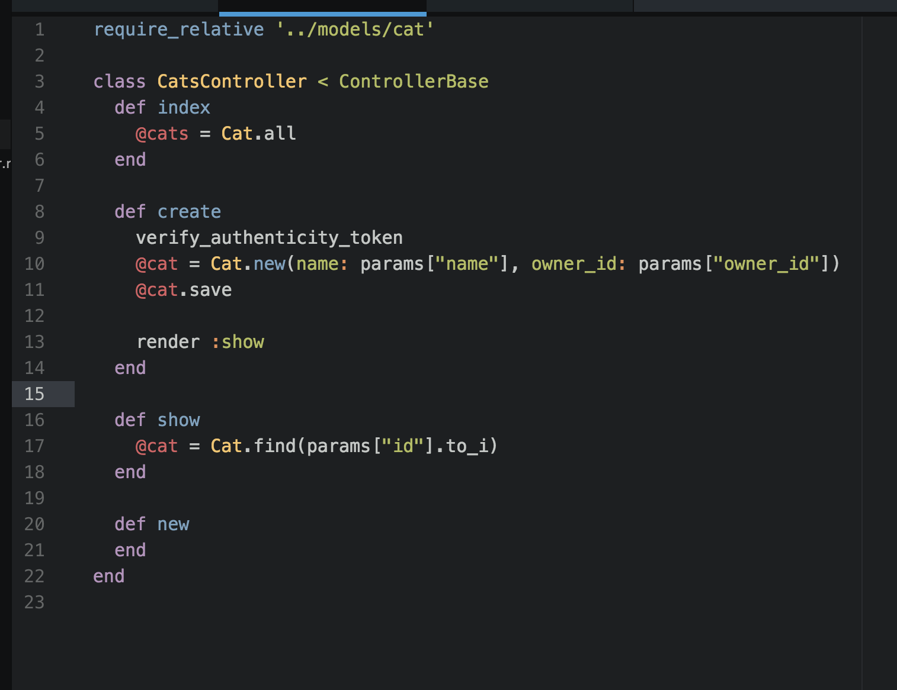
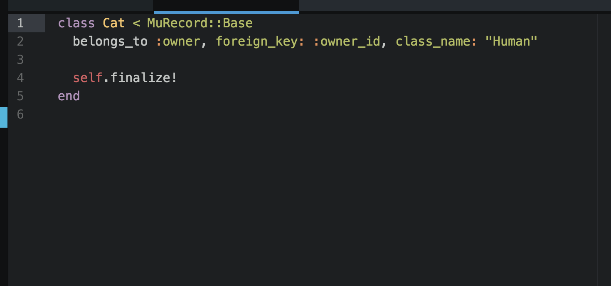

# About

Mu is a simple, lightweight DSL for jump-starting your web apps in Ruby.

### An example controller

Prevent CSRF attacks by including the #verify_authenticity_token in your controller actions.

### An example model

Creating associations is simple because of Mu's convention over configuration philosophy.

### An example of drawing routes in Mu

Drawing routes is easy, and fun! Enjoy custom middleware that serves up static assets and throws helpful errors with stack traces in development.

### Session

Store client user data as cookies using Mu's session dispatch. Simply call session[:some_key] in your controller.

### Flash

The flash is written into cookies much like the session, but in a special way so that it gets cleared with each request. If you prefer that a flash only persist within the same request, use flash.now.

e.g.

flash[:some_key] = "Thanks for signing up!" or:

flash.now[:some_key] = "Thanks for signing up!"
